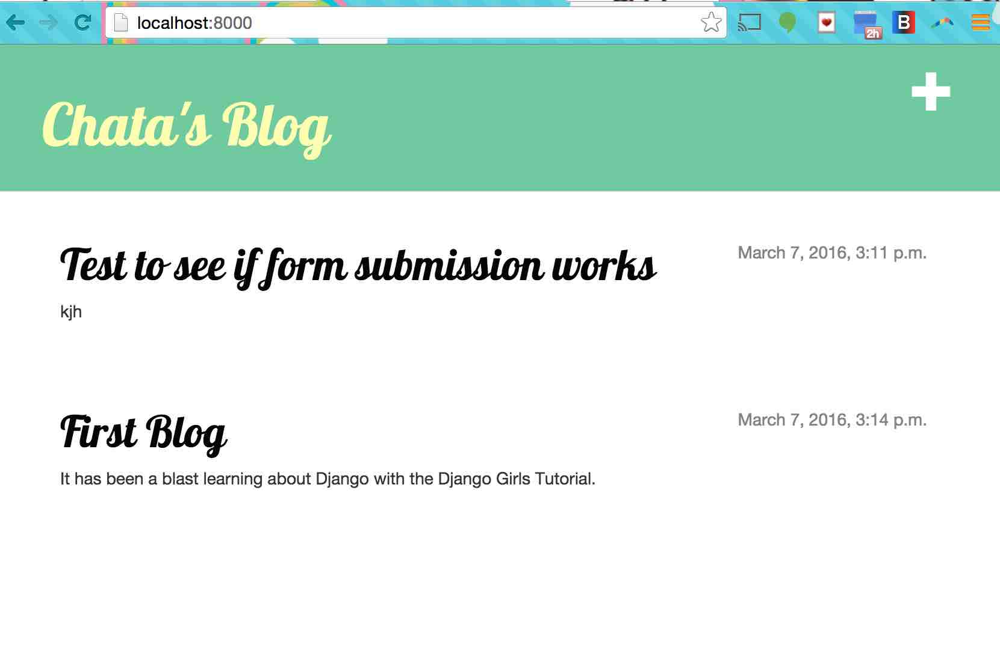
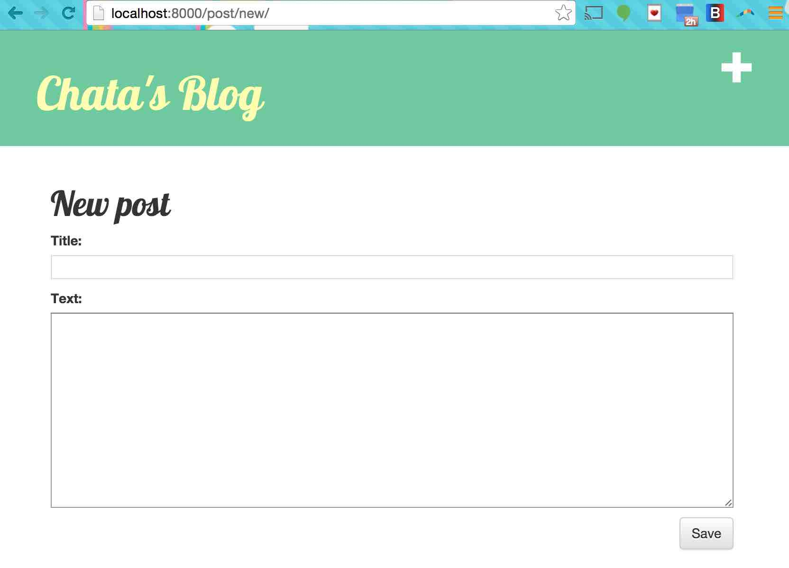
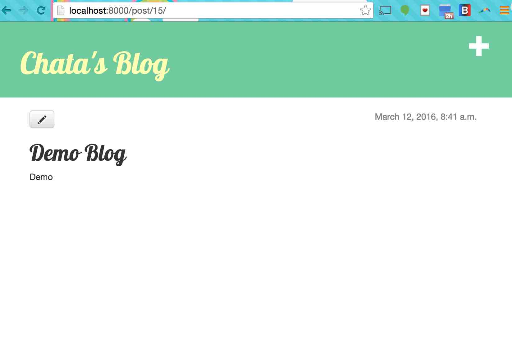
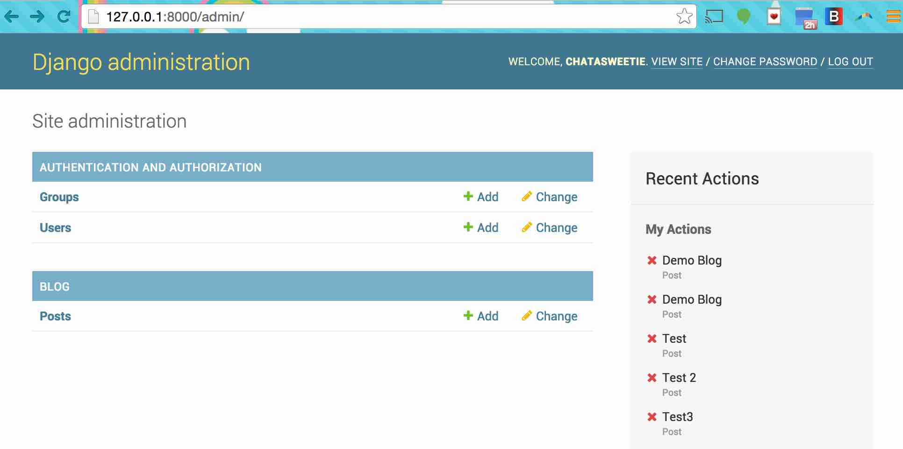
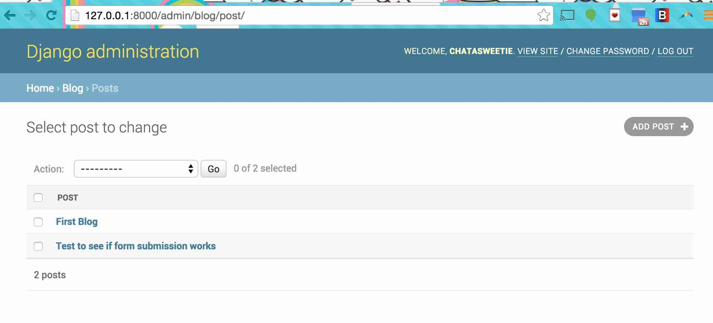

Django Blog
--------

**Description**

Blog web app using Django framework. Using [Django Girl's tutorial](http://tutorial.djangogirls.org/en/index.html).    


### Screenshot

**Blog Homepage**



**Add a Post**



**Edit a Post**



**Admin View**



**Admin Post Management**




### How to run locally


Create a virtual environment 

```
> virtualenv env
> source env/bin/activate
```

Install the dependencies

```
> pip install -r requirements.txt
```

Run Django server

```
> python manage.py runserver
```


Open your browser and navigate to 

```
http://localhost:8000/
```

Note: The functionality requires that you set a secret key set as local environment variables:

```
SECRET_KEY
```


### About the Developer    
Jessica Dene Earley    
[Short Bio](https://chatasweetie.wordpress.com/about-me/)    
[Linkedin](https://www.linkedin.com/in/jessicaearley)          
[Chatasweetie's Blog](https://chatasweetie.wordpress.com/)    
